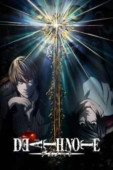

# DevOps-Project

## 1. Git Repository & Version Control
### Prerequisites:
+ GitHub account
+ Git installed

### Steps:

#### Rahim:
1. Create GitHub repository:
   - Repository name: DevOps-Project
   - Description: End-to-End DevOps Implementation for a Web Application
2. Clone repository:
   ```
   git clone https://github.com/rahim-aziz/DevOps-Project.git
   ```
3. Create index.html with following content:
   ```
   <html>
   <head>
   <title>Top 5 Anime</title>
   </head>
   <body>
   <h1>Top 5 Anime</h1>
   <br/>
   <p>1. Attack On Titan</p>
   <p>2. Death Note</p>
   <p>3. Fullmetal Alchemist</p>
   <p>4. One Punch Man</p>
   <p>5. Demon Slayer</p>
   </body>
   </html>
   ```
4. Commit and Push Changes:
   ```
   git add *
   git commit -m "Initial commit: Addex index.html, updated README.md"
   git push origin main
   ```

#### Aliff:
1. Fork repository on GitHub:
   - Repository: https://github.com/rahim-aziz/DevOps-Project.git 
2. Clone repository to local machine:
   ```
   git clone https://github.com/<enter-name>/DevOps-Project.git
   ```
3. Adding images to local repository
   > aot.jpg
   > deathnote.jpg
   > fmab.jpg
   > opm.jpg
   > demonslayer.jpg
4. Adding images to index.html
   ```
   <html>
   <head>
   <title>Top 5 Anime</title>
   </head>
   <body>
   <h1>Top 5 Anime</h1>
   <br/>
   <p>1. Attack On Titan</p>
   
   <p>2. Death Note</p>
   
   <p>3. Fullmetal Alchemist: Brotherhood</p>
   
   <p>4. One Punch Man</p>
   
   <p>5. Demon Slayer</p>
   
   </body>
   </html>

   ```
5. Stage, commit, and push changes:
   ```
   git add *
   git commit -m "Added images"
   git push origin main
   ```
6. Create Pull Request

#### Afeef:
1. Fork repository on GitHub:
   - Repository: https://github.com/rahim-aziz/DevOps-Project.git 
2. Clone repository to local machine:
   ```
   git clone https://github.com/<enter-name>/DevOps-Project.git
   ```
3. Added genre to index.html:
   ```
   <html>
   <head>
   <title>Top 5 Anime</title>
   </head>
   <body>
   <h1>Top 5 Anime</h1>
   <br/>
   <p>1. Attack On Titan</p>
   <p>Genre: Action, Adventure, Military</p>
   <p>2. Death Note</p>
   <p>Genre: Fantasy, Detective, Thriller</p>
   <p>3. Fullmetal Alchemist</p>
   <p>Genre: Action, Adventure, Magic</p>
   <p>4. One Punch Man</p>
   <p>Genre: Action, Comedy, Violence</p>
   <p>5. Demon Slayer</p>
   <p>Genre: Action, Fantasy, Demon</p>
   </body>
   </html>
   ```
4. Stage, commit, and push changes:
   ```
   git add *
   git commit -m "Added genre"
   git push origin main
   ```
5. Create Pull Request

#### Thaqief:
1. Fork repository on GitHub:
   - Repository: https://github.com/rahim-aziz/DevOps-Project.git 
2. Clone repository to local machine:
   ```
   git clone https://github.com/<enter-name>/DevOps-Project.git
   ```
3. Stylize index.html:
   ```
   <html>
   <head>
   <title>Top 5 Anime</title>
   </head>
   <body style="background-color: pink">
   <center>
   <h1>Top 5 Anime</h1>
   <br/>
   <p>1. Attack On Titan</p>
   <br/>
   <p>2. Death Note</p>
   <br/>
   <p>3. Fullmetal Alchemist</p>
   <br/>
   <p>4. One Punch Man</p>
   <br/>
   <p>5. Demon Slayer</p>
   </center>
   </body>
   </html>
   ```
4. Stage, commit, and push changes:
   ```
   git add *
   git commit -m "Added background color, and centerize elements"
   git push origin main
   ```
5. Create Pull Request
 

## 2. CI/CD Pipeline Setup
## 3. Containerization
## 4. AWS Deployment

